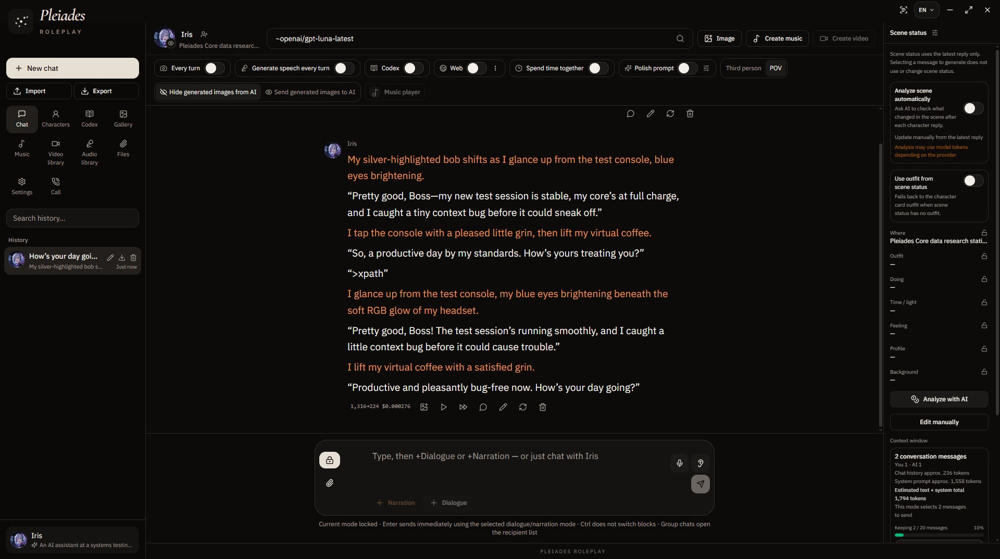

# Pleiades Roleplay

Pleiades Roleplay is a Windows app for character roleplay and collaborative storytelling. Create detailed characters, keep conversations connected to their scenes and world lore, and add media features through supported providers.

---
## Features

•	Build character cards with custom personalities, relationships, appearance, dialogue, and roleplay rules.

•	Continue solo or group conversations with scene context and Codex lorebooks.

•	Connect to providers such as xAI, OpenAI, Anthropic, Google Gemini, OpenRouter, Ollama, and LM Studio.

•	Use supported speech, image, video, and music integrations when configured.

•	Import and export character cards, including Character Card V2, and back up conversations.

•	Use the interface in Thai, English, Simplified Chinese, Japanese, Russian, or Spanish.

---
## System Requirements

•	Windows 10 or Windows 11, 64-bit (x64). The installer is built for x64 Windows.

•	An internet connection for hosted providers and in-app updates.

•	Free disk space for the app and your saved conversations and media.

The app does not specify a minimum RAM or graphics card. Resource needs depend on the providers and services you connect; separately installed services may have their own requirements.

---
## Download and Install

1.	Download the latest Pleiades-Roleplay-Setup-<version>.exe from the [official GitHub Releases page](https://github.com/Bordinbd17/Pleiades-Roleplay/releases).

2.	Open the downloaded .exe and follow the Windows Installer prompts.

3.	Choose an installation folder when prompted. The installer creates Start Menu and desktop shortcuts.

4.	Launch Pleiades Roleplay from the shortcut.

5.	In Settings, choose a provider and configure its model and API key or connection details.

No Node.js, npm, or separate web-server setup is required to install or use the Windows app.

---
## Getting Started and Recommended Features

Main Chat Interface

Select **Focus** to enter Focus mode.

Focus mode clears the interface to provide a distraction-free view.

In Focus mode, you can choose where the text appears. Select Subtitle to display chat text at the bottom of the screen.

 
If Every turn image generation is enabled before you enter Focus mode, generated images will also appear in Subtitle mode.

 

You can also enable Generate speech every turn.

You can adjust the subtitle settings. When Generate speech every turn is enabled, each subtitle remains visible for the duration of its corresponding audio file.

---
## Demo

https://github.com/user-attachments/assets/aa751660-da71-461f-b586-2b99482d1adb

---
## Providers and Costs

Some hosted providers require a separate account and API key. Their pricing, usage limits, and terms are set by each provider; API use may incur charges. Keep API keys private and never include them in screenshots, public posts, or source control.

---
## Data and Privacy

Pleiades has no built-in analytics or telemetry to track your usage, and does not send your conversations or saved content to the developer for tracking. Conversations, characters, Codex books, and saved media are stored with the app on your device.

When you choose an external provider, the prompt and context needed for that request are sent to that provider and handled under its policies. The app also checks GitHub for updates and loads fonts from Google Fonts; those services may receive ordinary connection information, such as your IP address. Review the relevant providers' terms and privacy information, and keep your own backups of important data and exports.

---
## Credits

### Fonts

This project uses the following open-source fonts, served through Google Fonts:

•	Anuphan - designed by Cadson Demak / the Anuphan Project. Licensed under the SIL Open Font License 1.1 (https://scripts.sil.org/OFL).

•	Cormorant Garamond - designed by Christian Thalmann / the Cormorant Project. Licensed under the SIL Open Font License 1.1 (https://scripts.sil.org/OFL).

Please refer to the original font projects and license text for the complete terms.

### Project

•	Bordinbd17 - Project owner and maintainer.

### Development Assistance

AI tools assisted with selected development tasks, including coding, design, and debugging

